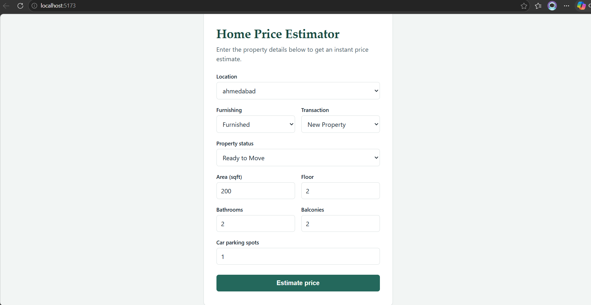
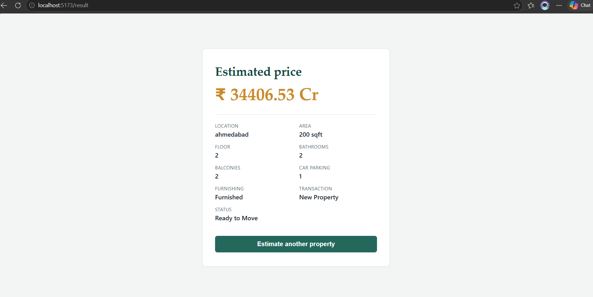

House Price Prediction

End-to-end machine learning application that predicts residential property prices in India from listing attributes (carpet area, location, floor, bathrooms, balconies, parking, furnishing, transaction type and possession status).

The project covers the full lifecycle: data cleaning and feature engineering in a Jupyter notebook, a trained scikit-learn pipeline serialized to disk, a REST API that serves predictions, and a web interface for end users.

 Overview

Property prices on Indian listing portals are stored as messy free text — `"1.40 Cr"`, `"42 Lac"`, `"779 sqft"`, `"10 out of 29"`. This project turns that raw text into a clean, model-ready dataset and exposes a trained regressor through a simple API and UI.

What it does

- Parses price strings (Lac / Cr) and area strings (sqft, sqm, acre, hectare) into numeric values.
- Engineers clean numeric features for floor, bathrooms, balconies and car parking.
- Groups the long tail of locations into the top 50 cities + other to keep one-hot encoding stable.
- Removes data-entry anomalies by trimming the 1st/99th percentile of price-per-sqft.
- Trains and compares Linear Regression vs Random Forest Regressor on a log-transformed target.
- Serves the winning model (Random Forest, R² = 0.949) via a /predict endpoint consumed by the frontend.

Tech Stack

Machine Learning

-Python
-Pandas
-NumPy
-Scikit-learn
-Jupyter Notebook

Backend

-FastAPI
-Uvicorn
-Pydantic
-Python

frontend

-React
-TypeScript
-Vite

Version Control

-Git
-GitHub

architecture diagram

User
  |
  v
React Frontend
  |
  | HTTP Request
  v
FastAPI Backend
  |
  v
Preprocessing
  |
  v
Machine Learning Model
  |
  v
Predicted House Price
  |
  v
React Result Page

> 
 Project Structure

house-price-prediction/
│
├── notebooks/
│   └── house_price_model.ipynb      
│
├── backend/
│   ├── main.py                      
│   ├── schemas.py                   
│   ├── predictor.py                 
│   ├── models/
│   │   ├── house_price_pipeline.pkl 
│   │   └── locations.json           
│   ├── requirements.txt
│   └── .env.example
│
├── frontend/
│   ├── src/
│   │   ├── components/
│   │   │   ├── PredictionForm.jsx
│   │   │   └── ResultCard.jsx
│   │   ├── services/api.js          #
│   │   ├── App.jsx
│   │   └── main.jsx
│   ├── index.html
│   ├── package.json
│   ├── vite.config.js
│   └── .env.example
│
├── data/
│   └── house_prices.csv             
│
├── assets/
│   └── screenshots/                 
│
├── .gitignore
└── README.md

 Dataset

Source: House Price Dataset (India) — Kaggle
(https://www.kaggle.com/datasets/juhibhojani/houseprice)

 Download instructions

Option A — Kaggle CLI 

pip install kaggle
kaggle datasets download -d juhibhojani/house-price -p notebooks/data --unzip 

Option B — Manual

1. Open the dataset page on Kaggle and click Download.
2. Unzip the archive.
3. Place house_prices.csv inside the data/ folder.

Backend Setup

cd backend

1. Create and activate a virtual environment
python -m venv venv
source venv/bin/activate        

2. Install dependencies
pip install -r requirements.txt

3. Configure environment
cp .env.example .env           

4. Make sure the model artifacts exist
ls models/                    

5. Run the API
uvicorn main:app --reload --port 8000

- API → http://localhost:8000
- Swagger docs → http://localhost:8000/docs
- Health check → http://localhost:8000/health

 Frontend Setup

Open a second terminal:

cd frontend

1. Install dependencies
npm install

2. Configure environment
cp .env.example .env            

3. Start the dev server
npm run dev

- App → http://localhost:5173

Production build

npm run build     
npm run preview   

Environment Variables

Backend — backend/.env

| Variable       |     | Description |

| MODEL_PATH     |     | Path to the serialized sklearn pipeline |
| LOCATIONS_PATH |     | Path to the allowed-locations list |

Frontend — frontend/.env

| Variable |             | Description |

| VITE_API_BASE_URL | | Base URL of the backend API |

API Reference

Base URL: http://localhost:8000

Health Check

GET /health

Prediction

POST /predict

cURL example

curl -X POST http://localhost:8000/predict \
  -H "Content-Type: application/json" \
  -d '{
    "carpet_area": 1200,
    "floor": 7,
    "bathrooms": 2,
    "balcony": 2,
    "car_parking": 1,
    "location": "mumbai",
    "furnishing": "Semi-Furnished",
    "transaction": "Resale",
    "status": "Ready to Move"
  }'

200 OK

 Model & Metrics

Pipeline

ColumnTransformer
├── numeric   → SimpleImputer(median) → StandardScaler
│              [carpet_area, floor, bathrooms, balcony, car_parking]
└── categorical → SimpleImputer(most_frequent) → OneHotEncoder(handle_unknown="ignore")
               [location_grouped, furnishing, transaction, status]
                          ↓
        RandomForestRegressor(n_estimators=100, max_depth=15, random_state=42)
                          ↓
        TransformedTargetRegressor(func=log1p, inverse_func=expm1)

Split:80 / 20 train-test, random_state=42 → 75,186 train / 18,797 test rows.

#Results (test set, 18,797 samples)

| Model |                 | MAE     | RMSE     | R² |

| Random Forest Regressor | 999,335 | 2,935,158| 0.9489 |

Screenshots

Home / Prediction Form

Prediction Result

